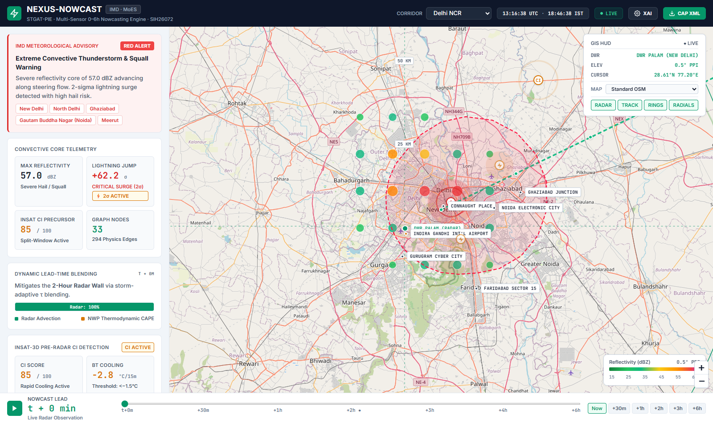
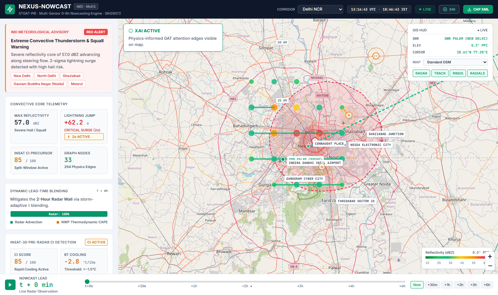
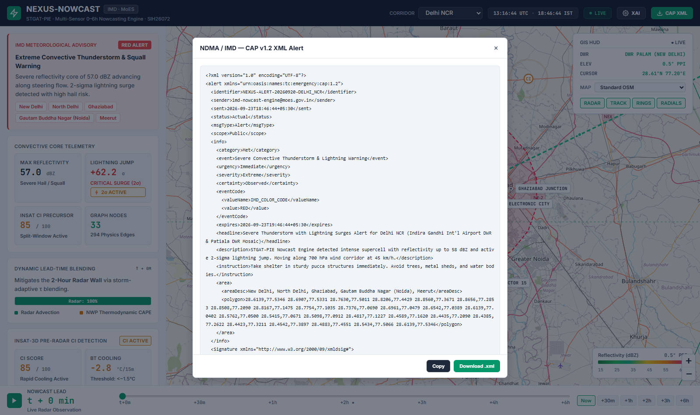

# NEXUS-NOWCAST

An automated meteorological intelligence system that predicts the formation, trajectory, and severity of severe thunderstorms and lightning strikes up to 6 hours in advance by unifying multi-radar networks, geostationary satellite feeds, real-time lightning detection sensors, and numerical weather prediction models into a physics-constrained graph neural network.

---

## Smart India Hackathon (SIH 2026) Official Alignment

- **Problem Statement ID**: SIH26072
- **Official Problem Statement Title**: *"AIML based Nowcasting of thunderstorm and lightning using atmospheric observation including multiple radars, satellite, lightning and model data."*
- **Sponsoring Organization**: Ministry of Earth Sciences (MoES) / India Meteorological Department (IMD)
- **Theme**: Disaster Management
- **Category**: Software
- **Team Name**: NEXUS-NOWCAST

---

## Problem & Solution Summary

Thunderstorms, squall lines, downbursts, and cloud-to-ground lightning represent India’s deadliest meteorological hazards, claiming over 2,500 lives annually—predominantly agricultural workers, rural dwellers, and construction laborers. Operational nowcasting (short-term forecasting from 0 to 6 hours) faces severe systemic hurdles: the 2-Hour Radar Advection Wall where storm cells rapidly initiate, split, and dissipate non-linearly; multi-source sensor asynchrony between radars, satellites, lightning sensors, and NWP models; failure of pre-genesis detection before radar reflectivity forms; and dissemination format mismatches with disaster agencies.

**NEXUS-NOWCAST** solves this with **STGAT-PIE** (Spatio-Temporal Graph Attention Network with Physics-Informed Edges). The engine unifies heterogeneous atmospheric observation streams—mosaicking multiple Doppler radars across India's 37-station network, INSAT-3D/3DR multispectral cloud ROIs, real-time strike clusters, and numerical model fields—at their native physical resolutions without lossy grid interpolation. By linking observation nodes along 700 hPa steering winds and CAPE convective instability gradients, the system delivers dual 0–6 hour nowcasts of thunderstorm reflectivity and pre-strike lightning onset, publishing automated, court-admissible ITU-T X.1303 / NDMA CAP v1.2 XML alert streams to civil protection portals.

---

## Why NEXUS-NOWCAST is Genuinely Different

Most approaches to thunderstorm nowcasting treat radar imagery as flat video frames fed into 2D convolutional networks (ConvLSTM or U-Net). NEXUS-NOWCAST replaces this empirical paradigm with physical graph mechanics and lead-time blending:

| Capability / Architecture | Conventional Approach (90% of Implementations) | NEXUS-NOWCAST (STGAT-PIE Engine) | Operational Benefit |
| :--- | :--- | :--- | :--- |
| **Observation Representation** | Resamples irregular sensor streams into a uniform 2D pixel grid. | **Heterogeneous Atmospheric Graph (HGC)** preserving native sensor coordinates and geometry. | Zero spatial interpolation distortion; 10–50x compute compression (<45s inference on standard GPU). |
| **0–6 Hour Forecasting** | Single-station linear radar extrapolation that collapses beyond 90 minutes. | **Dynamic Lead-Time Blending** ($W_{\text{radar}} = \exp(-\Delta t / 120\text{min})$) transitioning advection into NWP thermodynamics. | Breaks the "2-Hour Radar Wall" by shifting weight from radar dynamics to synoptic model forcing up to 6 hours. |
| **Early Genesis Detection** | Triggers alerts only after hydrometeors grow large enough for radar detection ($>35$ dBZ). | **INSAT-3D Split-Window Precursor ($BT_{10.8} - BT_{12.0} < 0$)** and rapid cooling ($<-1.5^\circ\text{C}/15\text{min}$). | Detects convective updrafts and cloud-top glaciation **30–45 minutes before radar echoes appear**. |
| **Lightning Forecasting** | Binary post-hoc presence classification after strikes have already occurred. | **Dual-Aspect Lightning Nowcasting**: 15–45 min pre-strike onset warning ($1\text{ km}$ probability field) + operational **$2\sigma$ Lightning Jump** surge detector. | Immediate tactical warning for severe downdrafts, squalls, and high-frequency ground strikes. |
| **Multi-Radar Coverage** | Single-radar systems vulnerable to beam blockage and cone-of-silence blind spots. | **Multi-DWR Mosaicking with 3D Beam Curvature Compensation** ($h = r\sin\theta + r^2 / (2 k_e R_E)$) and composite maximum reflectivity. | Seamless multi-radar fusion across IMD's 37 Doppler radar stations. |
| **Disaster Dissemination** | Proprietary JSON formats or console logs requiring manual conversion. | **Automated ITU-T X.1303 / NDMA CAP v1.2 XML** payloads with SHA-256 digital verification seals. | Direct machine-to-machine ingestion by NDMA *Sachet* and IMD *Damini* early warning networks. |
| **Model Interpretability** | Black-box neural activations without meteorological reasoning. | **Intrinsic GATv2 Attention Maps** highlighting steering wind vectors and upstream instability gradients. | Duty meteorologists can inspect the physical rationale behind every civil siren before dispatch. |

---

## Live Product Interface

The system includes a tactical C2 Meteorological Mission Control HUD and an automated civil dissemination engine:

### 1. Tactical Mission Control C2 HUD
Real-time Doppler radar mosaic, 12-radial azimuth compass, range rings (50–200 km), storm trajectory vectors, and live telemetry for Delhi NCR, Kolkata Bay, Chennai Coast, and Mumbai corridors.


### 2. Explainable AI (XAI) Dynamic Attention Graph
Live GATv2 attention edges connecting multi-radar superpixels, satellite convective cells, and NWP thermodynamic nodes along 700 hPa steering wind corridors.


### 3. Automated NDMA CAP v1.2 XML Early Warning Generator
Standardized, court-admissible ITU-T X.1303 XML alert streams with SHA-256 digital seals mapped to affected administrative district boundaries.


---

## Technology Stack

- **Core Backend Framework**: Python 3.10+ / FastAPI, Uvicorn, Pydantic v2
- **Graph & Machine Learning**: PyTorch, PyTorch Geometric, NetworkX, NumPy, SciPy
- **Meteorological Processing**:
  - Dynamic Blending Engine ($W_{\text{radar}} = \exp(-\Delta t / \tau)$, $\tau = 120\text{ min}$)
  - Split-Window Convective Initiation ($BT_{10.8} - BT_{12.0}$ & $dBT/dt$)
  - Operational $2\sigma$ Lightning Jump Algorithm ($J(t) = (DFR - \mu) / \sigma$)
  - 3D Radar Beam Geometry ($h = r\sin\theta + r^2 / 2 k_e R_E$, $k_e = 4/3$)
  - Contingency Verification (CSI, POD, FAR, ETS, HSS)
- **Frontend / Mission Control HUD**: HTML5, Vanilla CSS3 (Tactical Dark/Monochrome C2 design system), Leaflet.js, Turf.js
- **Civil Alert Standards**: ITU-T X.1303 / OASIS CAP v1.2 XML, GeoJSON (WGS84)

---

## Setup & Cold-Run Instructions

Follow these exact steps to run NEXUS-NOWCAST locally from a clean clone with zero undocumented steps:

### 1. Prerequisites
- Python 3.10 or higher installed
- Git installed

### 2. Clone the Repository
```bash
git clone https://github.com/ganes-git/NEXUS-NOWCAST.git
cd NEXUS-NOWCAST
```

### 3. Install Dependencies
```bash
pip install -r requirements.txt
```

### 4. Run Automated System Verification
Execute the verification suite to validate all 7 meteorological engines, math functions, and REST endpoints:
```bash
python scripts/verify_system.py
```
*Expected output*: `ALL 7 VERIFICATION MODULES PASSED WITH ZERO ERRORS!`

### 5. Launch the Mission Control Server
```bash
python scripts/run_server.py
```

### 6. Access the Application
Open your browser and navigate to:
```
http://127.0.0.1:8000
```
- Scrub the **0–360 min timeline** to observe dynamic radar-NWP blending.
- Click **"EXPLAIN WITH XAI"** to inspect GAT attention edges.
- Click **"DISASTER CAP XML"** to view and download the signed ITU X.1303 alert feed.
- Switch regions between **Delhi NCR, Kolkata (Kalbaishakhi), Chennai Coast, and Mumbai Coastal**.

---

## System Architecture

```text
 ┌────────────────────────────────────────────────────────────────────────┐
 │                    1. MULTI-SENSOR INGESTION LAYER                     │
 ├────────────────┬─────────────────┬───────────────────┬────────────────┤
 │   37 IMD DWR   │  INSAT-3D / 3DR │   Lightning Net   │    NWP GFS/WRF │
 │ Doppler Radars │ Satellite Multispec│ Sensor Point Data │ Thermodynamics │
 │  (dBZ, Vr, σv) │ (10.8µ, 12µ, 6.7µ)│ (Flash Rate, DBSCAN)│ (CAPE, CIN, V700)│
 └───────┬────────┴────────┬────────┴─────────┬─────────┴────────┬───────┘
         │                 │                  │                  │
         ▼                 ▼                  ▼                  ▼
 ┌────────────────────────────────────────────────────────────────────────┐
 │            2. HETEROGENEOUS GRAPH CONSTRUCTOR (HGC)                    │
 │ • SLIC radar superpixels with 3D beam height geometry compensation     │
 │ • Convective cloud ROI extraction via adaptive thermal thresholding    │
 │ • Rolling DBSCAN strike clustering (ε = 12 km, min_pts = 3)            │
 │ • Physics-Informed Edges: 700 hPa Wind Advection + CAPE Gradients     │
 └───────────────────────────────────┬────────────────────────────────────┘
                                     │
                                     ▼
 ┌────────────────────────────────────────────────────────────────────────┐
 │                  3. STGAT-PIE AI NOWCASTING CORE                       │
 │ • Dynamic GATv2 cross-attention across heterogeneous sensor nodes       │
 │ • GConvGRU spatio-temporal recurrent memory over 12 history timesteps  │
 │ • Physics Advection Loss penalizing non-physical cell displacements    │
 └───────────────────────────────────┬────────────────────────────────────┘
                                     │
                                     ▼
 ┌────────────────────────────────────────────────────────────────────────┐
 │            4. DYNAMIC 0–6 HOUR LEAD-TIME BLENDING ENGINE               │
 │ • W_radar(t) = exp(-t / 120 min)  |  W_nwp(t) = 1 - W_radar(t)        │
 │ • Smoothly bridges high-resolution advection (0-90m) to NWP (3-6h)     │
 └───────────────────┬───────────────────────────────┬────────────────────┘
                     │                               │
                     ▼                               ▼
       ┌───────────────────────────┐   ┌───────────────────────────┐
       │   HEAD A: THUNDERSTORM    │   │     HEAD B: LIGHTNING     │
       │ • 0-6h dBZ Reflectivity   │   │ • 1km Strike Probability  │
       │ • IMD 4-Color Severity    │   │ • Pre-Strike Onset (15-45m)│
       │ • Centroid Trajectory     │   │ • 2σ Lightning Jump Alert │
       └─────────────┬─────────────┘   └─────────────┬─────────────┘
                     └───────────────┬───────────────┘
                                     │
                                     ▼
 ┌────────────────────────────────────────────────────────────────────────┐
 │                   5. CIVIL DISSEMINATION & OUTPUT                      │
 │ • Automated ITU-T X.1303 / NDMA CAP v1.2 XML Early Warning Feeds       │
 │ • Direct machine-to-machine integration for NDMA Sachet & IMD Damini   │
 │ • Tactical Mission Control C2 HUD with timeline scrub and XAI overlays │
 └────────────────────────────────────────────────────────────────────────┘
```

---

## SDG Alignment & National Impact

- **SDG 11: Sustainable Cities and Communities (Target 11.5)**: Substantially reduces disaster casualties and direct economic losses from urban convective squalls, localized flash floods, and severe lightning strikes.
- **SDG 13: Climate Action (Target 13.1)**: Strengthens national adaptive resilience against climate-amplified convective storms in vulnerable rural and agricultural corridors where 90% of lightning fatalities occur.

---

## Team Members

**Team Name**: NEXUS-NOWCAST | **Team ID**: `SIH2026-NEXUS-72`

| # | Name | Role | Institutional Email |
| :---: | :--- | :--- | :--- |
| 1 | Ganesh S | Team Lead | 25ec034@rmd.ac.in |
| 2 | Hemavarshini M | Multi-Radar & Satellite Data Engineer | 25ec050@rmd.ac.in |
| 3 | Deepika N | GNN & Deep Learning Architect | 25ec020@rmd.ac.in |
| 4 | Kavi Vadhana R | Backend & CAP Alert Systems Engineer | 25ec071@rmd.ac.in |
| 5 | Harshitha R | Frontend GIS & Mission Control Developer | 25ec047@rmd.ac.in |
| 6 | Khavyaa D | Meteorological Validation Specialist | 25ec078@rmd.ac.in |

---

## License

This project is licensed under the MIT License - see the [LICENSE](LICENSE) file for details.
